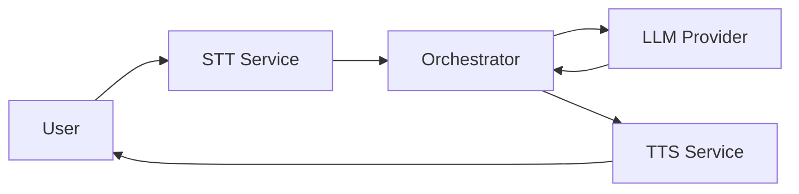

# Voice Agent
[](https://ndwang.github.io/voice_agent/)

An event-driven, multi-service voice agent system that integrates speech-to-text (STT), language models (LLM), and text-to-speech (TTS) to create an intelligent voice assistant.


## 🚀 Quick Start

### 1. Installation
```bash
# Clone the repository
git clone https://github.com/ndwang/voice_agent.git
cd voice_agent

# Install dependencies using uv
uv sync
```
*Note: The default setup assumes CUDA 12.6. Optional components like **blivedm**, **ChatTTS**, **Genie TTS**, and **Edge-TTS** require separate installation or system setup. See the [Installation Guide](https://wdong.github.io/voice_agent/guide/installation/) for details.*

### 2. One Step Start
```bash
uv run python scripts/start_services.py
```
This script starts the **STT Service**, **TTS Service**, and the **Orchestrator**.

To stop everything:
```bash
uv run python scripts/stop_services.py
```

### 3. Usage
- **Talk**: Simply speak into your microphone.
- **Toggle**: Use `Ctrl+Shift+L` to enable/disable listening.
- **Cancel**: Use `Ctrl+Shift+C` to stop the current response.
- **Web UI**: Visit `http://localhost:8000/ui` for the control panel.

### Ports
- **Orchestrator**: `http://localhost:8000` (UI: `/ui`)
- **STT**: `http://localhost:8001`
- **TTS**: `http://localhost:8003`
- **OCR** (optional): `http://localhost:8004`

## 📚 Documentation

For detailed guides on architecture, configuration, and service details, visit our **[Documentation Site](https://ndwang.github.io/voice_agent/)**.

### Local Documentation
To run the documentation site locally:
```bash
uv pip install mkdocs-material mkdocs-mermaid2-plugin
uv run mkdocs serve -a 127.0.0.1:8010
```
Then visit `http://localhost:8010`.

## 🏗️ Architecture

The system uses a microservices architecture coordinated by an asynchronous **Event Bus**.



For a deep dive, see the [Architecture Overview](https://wdong.github.io/voice_agent/architecture/overview/).

## 🛠️ Configuration
All settings are managed in `config.yaml`. See the [Configuration Guide](https://wdong.github.io/voice_agent/guide/configuration/) for details.

## 📄 License
MIT License — see `LICENSE`.
