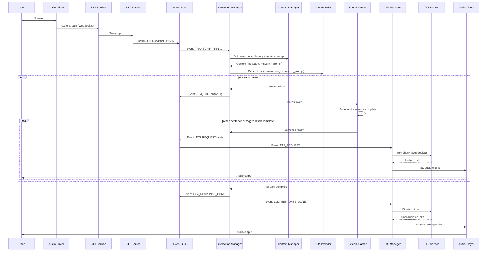
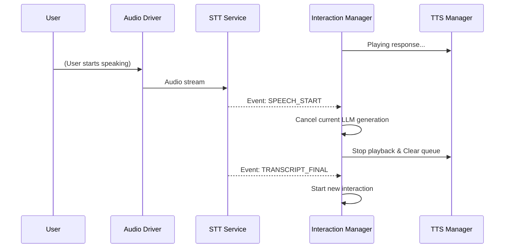

# Interaction Flow & Logic

The `InteractionManager` is responsible for the main loop of the voice agent. It translates user speech into agent responses by orchestrating the flow between STT, LLM, and TTS.

## The Interaction Pipeline

The standard flow follows these steps:

1. **Transcript Finalized**: `STTSource` publishes `TRANSCRIPT_FINAL`.
2. **Context Preparation**: `InteractionManager` asks `ContextManager` for the conversation history + system prompt.
3. **LLM Generation**: The prompt is sent to the LLM provider. Tokens are streamed back.
4. **Stream Parsing**: Tokens are passed through a parser.
5. **TTS Request**: When a complete sentence or tagged block is identified, a `TTS_REQUEST` is published.
6. **Audio Playback**: `TTSManager` receives the request, streams it to the TTS Service, and sends the resulting audio chunks to the `AudioPlayer`.

### Standard Flow Sequence Diagram

## Interruption Logic

One of the most complex parts of the system is handling interruptions (when the user starts speaking while the agent is still responding).

### Concatenation Logic
If the user interrupts the agent *before* it finishes its sentence, the system can be configured to concatenate the interrupted prompt with the next user input, ensuring the agent understands the context of the unfinished thought. Currently this is commented out.

