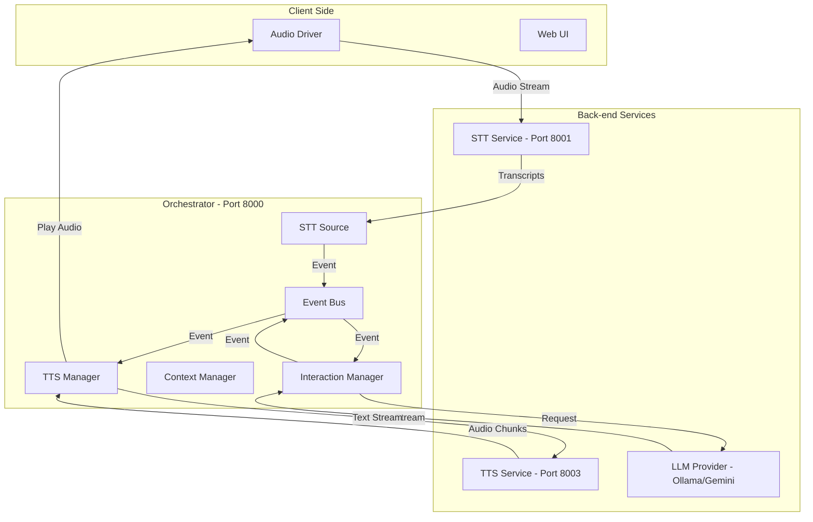

# System Architecture Overview

The Voice Agent is built on a **Microservices Architecture** using an **Event-Driven** core. This design ensures that each component (STT, TTS, LLM) can operate independently and asynchronously, providing a responsive experience.

## High-Level Diagram

## Core Components

### 1. Orchestrator
The "brain" of the system. It doesn't perform heavy AI processing itself but coordinates between services. It maintains the **Event Bus**, manages conversation context, and handles the logic for starting/stopping interactions.

### 2. Event Bus
A simple, internal pub/sub system. Every major action (transcript received, user spoke, LLM generated a token, TTS finished) is an **Event**. This allows components like the `SubtitleManager` or `LatencyTracker` to "listen" to the system without being tightly coupled to the main logic.

### 3. Audio Driver
A local component that handles hardware interaction. It uses **Voice Activity Detection (VAD)** to capture microphone input only when speech is detected and handles the real-time playback of audio chunks received from the TTS service.

### 4. AI Services (STT & TTS)
Stateless services that wrap specific AI models. They expose WebSocket APIs for real-time streaming, allowing the Orchestrator to pipe text or audio through them with minimal overhead.

